# Games

Human-edited registry for this repo. To **enumerate installable packages** from `environment_files/` (full `game_id` + title), run `uv run python run_game.py --list` — it uses [`Arcade.get_environments()`](https://docs.arcprize.org/toolkit/list-games) when the toolkit supports it. In code: `Arcade(environments_dir="environment_files", operation_mode=OperationMode.OFFLINE).get_environments()`. **Hand-play** (WASD, click for ACTION6, etc.): `uv run python run_game.py --game <stem> --version auto --mode human` — **pygame** window via `scripts/human_play_pygame.py`.

| Game | Category | Grid | Levels | Description | Preview | Actions |
|------|----------|------|--------|-------------|---------|---------|
| ez01 | Tutorial / Movement Basics | 8×8 | 5 | Go UP to reach the target. | 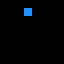 | • 1-4: Movement |
| ez02 | Tutorial / Movement Basics | 8×8 | 5 | Go LEFT to reach the target. | 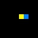 | • 1-4: Movement |
| ez03 | Tutorial / Movement Basics | 8×8 | 5 | Go RIGHT to reach the target. | 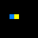 | • 1-4: Movement |
| ez04 | Tutorial / Movement Basics | 8×8 | 5 | Go DOWN to reach the target. | 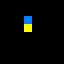 | • 1-4: Movement |
| ul01 | Puzzle Mechanics | 8×8 | 5 | Pick up the key to unlock the door and advance. |  | • 1-4: Movement |
| tt01 | Collection | 8-24 | 3 | Collection game. Navigate grid to collect yellow targets while avoiding red hazards (static collidable cells). | 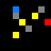 | • 1-4: Movement |
| wm01 | Survival / Timing | 32×32 | 5 | Whack-a-Mole! Click moles before they escape. Meet checkpoint requirements or lose. | 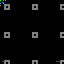 | • 6: Click |
| sv01 | Survival / Timing | 8-24 | 5 | Survival game. Manage hunger and warmth. Green food restores hunger; orange warm zones stop warmth loss. Survive 60 frames to advance. | 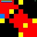 | • 1-4: Movement • 5: Idle (wait) |
| pt01 | Pattern Puzzles | 64×64 | 5 | Pattern rotation puzzle. Click tiles to rotate them 90° clockwise and match the target pattern. |  | • 6: Click/Rotate |
| sy01 | Pattern Puzzles | 11×11 | 5 | Mirror Maker. Mirror the pattern from the left side onto the right side. Create a perfect reflection! | 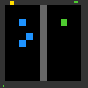 | • 6: Click (place/remove block) |
| sk01 | Environmental Manipulation | 8-12 | 5 | Sokoban. Push blocks onto target pads. Green = placed. Wall blockers ramp up by level. Step limit exceeded = lose. |  | • 1-4: Movement |
| tb01 | Environmental Manipulation | 24×24 | 5 | Bridge Builder. **Multi-island** routes (waypoints + optional reef clusters); bridge open water (ACTION6), walk island-to-island to the green goal. Later levels add **max_bridges** / **step_limit**; blue ticks show level index. Swimming costs a life. | 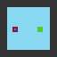 | • 1-4: Movement • 6: Toggle bridge on water (click) |
| ff01 | Precision / Topology | 64×64 | 5 | Flood fill: click inside **closed** regions to paint them yellow. Five levels mix **rectangles**, **donut/ring**, and **C-bays** with ramping shape count. Sq01-style click ripple in final frame space; **ACTION1–4** are no-ops (pacing). |  | • 1-4: No-op • 6: Click |
| mm01 | Memory / Hidden State | 64×64 | 7 | Memory Match. Level 1 has 2 pairs, then +1 pair per level up to 8 pairs. Flip pairs of hidden tiles to find matching colors. Match all pairs to win. Time runs out = lose. |  | • 6: Click tile |
| ms01 | Memory / Hidden State | 8-16 | 5 | Blind Sapper. Navigate a hidden minefield using deduction. Safe tiles reveal adjacent mine counts. Step on a mine = lose. Reach the goal to win. Tests working memory and deductive planning. |  | • 1-4: Movement |
| sq01 | Sequencing / Ordering | 12×12 | 5 | Sequencing. Click colored blocks in the correct order. Follow the sequence shown at the top! | 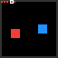 | • 6: Click block |
| rs01 | Cognitive Flexibility / Rule Switching | 8-16 | 5 | Rule Switcher. Collect colored targets that match the signpost color at top. Wrong color = lose. After all colors cycle through as safe, collect remaining targets. Tests cognitive flexibility and rule adaptation. |  | • 1-4: Movement |
| pb01 | Environmental Manipulation | 8-10 | 5 | One-box push. Single crate and one goal per level; push the block onto the yellow pad. Step limit exceeded = lose. |  | • 1-4: Movement |
| fs01 | Puzzle Mechanics | 8-10 | 5 | Floor switches. Step on every yellow pressure plate (any order) to open the gray door, then reach the green goal. |  | • 1-4: Movement |
| tp01 | Puzzle Mechanics | 8-10 | 5 | **Symmetric** teleporters: either end of a pair warps to the other (HUD: ↔ + pair ticks). Reach the yellow goal. | 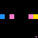 | • 1-4: Movement |
| ic01 | Puzzle Mechanics | 8-10 | 5 | **Ice slide:** one movement action = **slide in a straight line** until the next cell would be **OOB**, a **wall**, or a **red hazard** (you **stop before** entering those). **Yellow goal does not block** a slide—you can land on it mid-slide; a **wall past the goal** forces a stop on the goal tile. Corner HUD: **light blue** = ice, **yellow** = standing on goal. |  | • 1-4: Movement |
| va01 | Coverage / Path | 4-8 | 5 | Visit all. Walk on every walkable floor cell at least once to clear the level. |  | • 1-4: Movement |
| pb02 | Environmental Manipulation | 8-10 | 5 | Two crates, two yellow goals; push both blocks onto pads (sk01-style). |  | • 1-4: Movement |
| pb03 | Environmental Manipulation | 8-10 | 5 | Decoy orange pad — pushing a crate onto it loses; real goals stay yellow. |  | • 1-4: Movement |
| fs02 | Puzzle Mechanics | 8-10 | 5 | Floor switches **OR**: **orange** plates — stepping on **any one** opens the door (redundant branches, not a count). |  | • 1-4: Movement |
| fs03 | Puzzle Mechanics | 8-10 | 5 | Floor switches **k-of-n**: step on **k** distinct **yellow** plates (**any order**); **k** = `required_plates` in level data (corner HUD shows **k** ticks). Extras optional. |  | • 1-4: Movement |
| tp02 | Puzzle Mechanics | 8-10 | 5 | **One-way** teleporters (`directed_pairs`): only the source tile warps; orange HUD arrows mark sources + exit direction. | 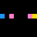 | • 1-4: Movement |
| tp03 | Puzzle Mechanics | 8-10 | 5 | **Single-use** links: each pair vanishes after one warp (HUD: remaining pair ticks + burn flash on landing). |  | • 1-4: Movement |
| ic02 | Puzzle Mechanics | 8-10 | 5 | **Torus** ice slide: wraps at grid edges until a wall/hazard stops you. |  | • 1-4: Movement |
| ic03 | Puzzle Mechanics | 8-10 | 5 | **Capped** slide: each move travels at most `slide_cap` cells (`level.data`). |  | • 1-4: Movement |
| va02 | Coverage / Path | 4-8 | 5 | Visit every **non-hazard** floor cell; red hazard cells never need coverage. **Visited** cells stay **green** (trail). **Three** blocked moves (OOB / wall / hazard) on a level = lose; corner HUD shows strikes left. |  | • 1-4: Movement |
| va03 | Coverage / Path | 4-8 | 5 | Visit yellow waypoints **in order** with a **fixed move budget** (shortest solve length). OOB/wall don’t use moves. Waste the budget or mistime the final step = lose. |  | • 1-4: Movement |
| nw01 | Puzzle Mechanics | 8-10 | 5 | **Arrow tiles:** stepping onto one **queues** its direction; your **next** move uses that vector instead of your key (then it clears). **Orange** HUD = forced move queued. |  | • 1-4: Movement |
| bd01 | Coverage / Path | 5-8 | 5 | **No revisits** — entering any cell twice **loses**; reach the goal. **Red** tiles mark cells you already left; HUD corners **red** on revisit fail. |  | • 1-4: Movement |
| gr01 | Puzzle Mechanics | 8-10 | 6 | **Gravity**: after each move, one auto-step **down** (if clear). **Lose** if the goal is **unreachable** (BFS with same rules), confirmed on **two** consecutive steps. **Dense gray walls** per level (still fully solvable); L0 keeps the **walled pit** for the registry fail beat. |  | • 1-4: Movement |
| dt01 | Puzzle Mechanics | 8-10 | 5 | **Detour:** cyan waypoint arms only when you **enter it from the required side** (`waypoint_enter_from`: **n**/ **e**/ **s**/ **w**); then the yellow goal counts. | 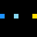 | • 1-4: Movement |
| wk01 | Puzzle Mechanics | 8-10 | 5 | **Weak floor**: brown tiles collapse to holes after you leave; holes are lethal. HUD turns **red** on hole death. |  | • 1-4: Movement |
| rf01 | Puzzle Mechanics | 8-10 | 5 | **Mirror half-plane**: on `x >= mid`, left/right inputs are swapped. |  | • 1-4: Movement |
| mo01 | Puzzle Mechanics | 8-10 | 5 | **Momentum**: need **≥2** steps in a row before changing direction; early turn = lose. | 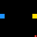 | • 1-4: Movement |
| zq01 | Puzzle Mechanics | 8-10 | 5 | **Zone timer**: blinking red hazard cells toggle on a fixed period (`period`, `hazard_cells`). | 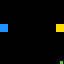 | • 1-4: Movement |
| hm01 | Coverage / Path | 3-6 | 5 | **Hamiltonian** tour — every open cell **exactly once**; revisit = lose. |  | • 1-4: Movement |
| ex01 | Puzzle Mechanics | 8-10 | 5 | **Exit hold**: stand on green exit pad and repeat **ACTION5** `hold_frames` times to clear. | 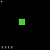 | • 1-4: Movement • 5: Hold / charge exit |
| gp01 | Pattern Puzzles | 8×8 | 5 | **Grid paint**: **ACTION6** toggles yellow on cells to match gray hints; **ACTION1–4** are no-ops. | 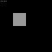 | • 1-4: No-op • 6: Click |
| lo01 | Pattern Puzzles | 3×3–5×5 | 5 | **Lights Out**: **ACTION6** toggles a cell and its neighbors; clear all lights. **ACTION1–4** are no-ops. |  | • 1-4: No-op • 6: Click |
| lw01 | Path / Topology | 24–32 | 5 | **Line weave**: connect colored starts to matching ends with orthogonal paths; colors cannot share cells. | 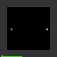 | • 1–2: Prev/next color • 3–4: No-op • 5: Undo segment • 6: Extend path (click) |
| rp01 | Graph / Logic | 32×32 | 5 | **Relay pulse**: **ACTION6** toggles relays; **ACTION5** fires from the source; orthogonal relay chain must light every lamp (adjacent to a visited relay). | 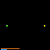 | • 1–4: No-op • 5: Fire pulse • 6: Toggle relay |
| ml01 | Geometry | 24×24 | 5 | **Mirror laser (single goal)**: **global** **ACTION6** clicks place/cycle mirrors (**purple** = ``/``, **light magenta** = ``\\``) on any valid floor cell; **ACTION5** fires a full ray; **1–4** no-op. **No** blue avatar — only emitter / receptor / walls / mirrors. Levels: wall detours → preset shortcut → south emitter + hazards → diagonal posts. **Magenta** = last-shot trace. See `scripts/render_ml01_gif.py`. | 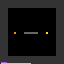 | • 1–4: No-op • 5: Fire • 6: Mirror (click) • 7: Undo last 5/6 |
| sf01 | Pattern Puzzles | 64×64 | 5 | **Stencil paint**: move a 3×3 stencil with **ACTION1–4**; **ACTION5** paints all non-wall cells under it; match gray hints. | 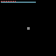 | • 1–4: Move stencil • 5: Paint |
| ll01 | Simulation | 32×32 | 5 | **Generations lock**: Conway Life; **ACTION6** toggles cells (budget); **ACTION5** advances one generation; after exactly **N** steps the live set must equal the target. |  | • 1–4: No-op • 5: Step CA • 6: Toggle cell |
| wl01 | Environmental Manipulation | 32×32 | 5 | **Wall craft**: reach the goal; **ACTION5** toggles build mode; **ACTION6** places/removes your walls (shared budget). | 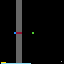 | • 1–4: Move • 5: Build mode • 6: Toggle my wall |
| dd01 | Logistics | 48×48 | 5 | **Drone relay**: pick up crates and deliver to yellow pads; when not on crate/pad, **ACTION5** pings the nearest pad on the HUD. | 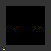 | • 1–4: Move • 5: Pickup/drop or ping pad |
| ck01 | Graph / Logic | 24×24 | 5 | **Circuit stitch**: **ACTION6** toggles wire; **ACTION5** tests whether the cyan input reaches the yellow output (limited checks). | 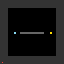 | • 1–4: No-op • 5: Test wire • 6: Toggle wire |
| ph01 | Field / Math | 24×24 | 5 | **Phase interference**: phases 0–3; **ACTION6** increments a cell; **ACTION5** applies (self + Σ orth neighbors) mod 4 on non-walls; match marked targets. |  | • 1–4: No-op • 5: Blur step • 6: Increment phase |
| bn01 | Exploration | 64×64 | 5 | **Beacon sweep**: hidden targets; **ACTION5** drops a beacon (Chebyshev radius); ghosts show only under light; **ACTION6** flags a cell (wrong cell = lose). | 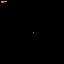 | • 1–4: Move • 5: Beacon • 6: Flag |
| dl01 | Puzzle / Planning | 12×12 | 5 | **Delay line**: moves queue (max 3); each step runs the oldest pending move then enqueues the current direction; **ACTION5** clears the queue. | 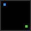 | • 1-4: Enqueue move • 5: Clear queue |
| fw01 | Survival / Simulation | 24×24 | 5 | **Wildfire**: fire spreads on a timer; **ACTION6** splashes water (3×3); reach the green exit. | 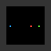 | • 1-4: Move • 6: Splash |
| gp02 | Pattern Puzzles | 8×8 | 5 | **Grid paint erase**: floor starts fully painted; **ACTION6** erases yellow; leave paint only on gray hint cells. |  | • 1-4: No-op • 6: Click erase |
| hd01 | Survival / Timing | 16×16 | 5 | **Heat front**: a heat band advances south every N steps; **ACTION5** on a magenta station charges temporary immunity; reach the goal. | 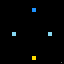 | • 1-4: Move • 5: Charge on station |
| kn01 | Puzzle / Movement | 16×16 | 5 | **Knight’s courier**: **ACTION1–4** use L-shaped knight hops from the active bank; **ACTION5** toggles between two banks (eight directions total). |  | • 1-4: Knight move • 5: Toggle bank |
| lo02 | Pattern Puzzles | 4×4–6×6 | 5 | **Torus Lights Out**: **ACTION6** toggles a cell and orthogonal neighbors with edge wrap; walls block toggles on their cells. |  | • 1-4: No-op • 6: Click |
| mc01 | Coordination | 16×16 | 5 | **Tandem**: two players take the same Δ each step; **ACTION5** swaps which avatar is “lead” for collision resolution; both must reach their goals. | 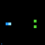 | • 1-4: Joint move • 5: Swap lead |
| ng01 | Logic / Deduction | 8×8 | 5 | **Nonogram lite**: **ACTION1–4** move the cursor; **ACTION6** (click) cycles empty / filled / mark on the clicked cell (cursor jumps to click); filled cells must match the hidden solution. | 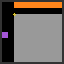 | • 1-4: Cursor • 6: Click cycle cell |
| ob01 | Multi-Agent | 16×16 | 5 | **Odd one out**: three bodies; **ACTION5** cycles which avatar **ACTION1–4** moves; each reaches its pad. | 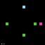 | • 1-4: Move active • 5: Cycle active |
| pu01 | Graph / Plumbing | 16×16 | 5 | **Pipe twist**: **ACTION6** toggles horizontal vs vertical pipe on a cell; connect cyan source to yellow sink with orthogonal flow. |  | • 1-4: No-op • 6: Toggle pipe |
| qr01 | Pattern Puzzles | 8×8 | 5 | **Quad twist**: **ACTION6** rotates the 2×2 block of tiles anchored at the click clockwise; match the target pattern. | 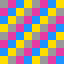 | • 1-4: No-op • 6: Rotate 2×2 |
| rs02 | Cognitive Flexibility | 8-16 | 5 | **Dual safe**: collect targets matching **either** color of the active pair (`dual_pairs`); after all pairs have been safe, any remaining target is allowed. | 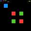 | • 1-4: Move |
| sk02 | Environmental Manipulation | 8-12 | 5 | **Sliding crate sokoban**: after a successful push, if the cell beyond the crate is empty, the crate slides one more step. |  | • 1-4: Move |
| sp01 | Simulation | 12×12 | 5 | **Sandpile**: **ACTION6** adds a grain; cells with ≥4 topple to neighbors; win when the grid is stable and total grains equals **target_sum**. |  | • 1-4: No-op • 6: Add grain |
| sq02 | Sequencing | 12×12 | 5 | **Shrinking queue**: like sequencing, but only the current expected color block is eligible/visible until unlocked; wrong order resets progress. | 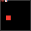 | • 6: Click block |
| sv02 | Survival / Timing | 8-24 | 5 | **Shelter survival**: warmth decay pauses only inside magenta **shelter** zones; hunger rules unchanged; survive 60 steps per level. |  | • 1-4: Move • 5: Idle |
| tb02 | Environmental Manipulation | 24×24 | 5 | **Bridge decay**: like bridge builder, but a bridge sprite is removed when you **leave** that water cell. | 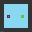 | • 1-4: Move • 6: Toggle bridge |
| tc01 | Puzzle / Fields | 16×16 | 5 | **Conveyor layer**: after each resolved move, you are pushed one more step by the arrow at your **destination** cell (`arrows` in level data). | 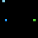 | • 1-4: Move |
| tt02 | Collection | 16-24 | 3 | **Patrol hazards**: collect yellow targets while red **patrol** hazards step along authored tracks (`patrols`) every player step. |  | • 1-4: Move |
| zm01 | Territory | 16×16 | 5 | **Flood duel**: two colors expand from seeds; **ACTION5** switches the active color; **ACTION6** claims a floor cell orthogonally adjacent to your region (cover a target fraction to win). | 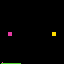 | • 1-4: Move • 5: Switch color • 6: Expand |
| as01 | Logistics | 12×12 | 5 | **Assembly fetch**: **ACTION5** pickup/drop tagged parts; deliver to matching workstations in **order** from `level.data`. | 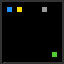 | • 1-4: Move • 5: Pickup/drop |
| bp01 | Graph / Power | 14×14 | 5 | **Battery mesh**: carry charge; drop on towers to link a range-1 power graph; goal activates when powered. | 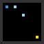 | • 1-4: Move • 5: Charge pickup/drop |
| bn02 | Exploration | 64×64 | 5 | **Manhattan beacon**: like bn01 but reveal uses L1 (Manhattan) radius. |  | • 1-4: Move • 5: Beacon • 6: Flag |
| ck02 | Graph / Logic | 24×24 | 5 | **Circuit junction**: wire like ck01; on `junction` cells, **no right turn** relative to incoming wire direction. |  | • 1-4: No-op • 5: Test wire • 6: Toggle wire |
| cr01 | Environmental Manipulation | 16×16 | 5 | **Creek crossing**: limited **ACTION6** planks on river; planks break when you leave; reach the goal. |  | • 1-4: Move • 6: Place plank |
| dm01 | Tiling | 8×8 | 5 | **Domino cover**: **ACTION6** toggles dominoes on valid pairs; cover all marked cells once. |  | • 6: Toggle domino |
| ex02 | Puzzle Mechanics | 8-10 | 5 | **Sliding exit hold**: **ACTION5** on pad increments hold; moving only **decays** hold by 1 (not full reset). |  | • 1-4: Move • 5: Hold |
| fl01 | Path / Numberlink | 12×12 | 5 | **Numberlink**: connect numbered endpoints with paths of exact per-pair length; no overlap (`pairs`, `length` in data). **ACTION6** extends/cuts at the clicked grid cell. | 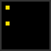 | • 1-4: Cursor • 6: Click extend/cut |
| ff02 | Precision / Topology | 64×64 | 5 | **Flood unpaint**: interiors start filled; **ACTION6** erases a clicked enclosure; gray hints must end empty. **ACTION1–4** no-op. | 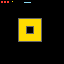 | • 1-4: No-op • 6: Click erase region |
| gp03 | Pattern Puzzles | 8×8 | 5 | **Three-state grid paint**: cycle cell colors with **ACTION6**; match per-cell `goal` palette in data. |  | • 1-4: No-op • 6: Cycle paint |
| lw02 | Path / Topology | 24–32 | 5 | **Shared corridor weave**: like lw01 but paths may **share** cells; **perpendicular** entry to another color’s visited cell is forbidden. | 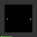 | • 1–2: Color • 3–4: No-op • 5: Undo • 6: Extend |
| ml02 | Geometry | 24×24 | 5 | **Dual-receptor laser**: like **ml01** optics but **all** yellow receptors in **one** shot; **blue** technician **moves** (**1–4**); **ACTION6** only on cells **orthogonally adjacent** to technician; mirrors **persist** after each shot. | 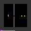 | • 1-4: Move • 5: Fire • 6: Mirror |
| mm02 | Memory / Hidden State | 64×64 | 5 | **Memory triples**: flip three tiles; clear when all three match color. |  | • 6: Click tile |
| ms02 | Memory / Hidden State | 8-16 | 5 | **Flag sapper**: **ACTION6** plants flags on hidden mines; wrong flag = lose; reach the goal. |  | • 1-4: Move • 6: Flag |
| mx01 | Puzzle Mechanics | 10×10 | 5 | **Maze melt**: **ACTION5** melts one adjacent wall segment (budget); reach exit when a path exists. | 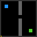 | • 1-4: Move • 5: Melt |
| nw02 | Puzzle Mechanics | 8-12 | 5 | **Vector arrows**: arrow tiles **add** to a pending (dx,dy); next move executes the **sum** clamped to one step. |  | • 1-4: Move |
| ph02 | Field / Math | 24×24 | 5 | **Phase multiply**: **ACTION5** applies multiply-style update with orthogonal neighbors **mod N** (`mod_n` in data). |  | • 1-4: No-op • 5: Step • 6: Inc |
| pt02 | Pattern Puzzles | 64×64 | 5 | **Row/column rotate**: **ACTION6** rotates a full row **or** column of 3×3 tiles (nearest axis wins). | 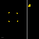 | • 6: Click band |
| rp02 | Graph / Logic | 32×32 | 5 | **Pulse depth**: relays + **amplifiers** reset hop budget (`max_pulse_depth`); light all lamps. | 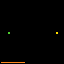 | • 1–4: No-op • 5: Fire • 6: Toggle relay |
| rz01 | Environmental Manipulation | 12×12 | 5 | **Rush grid**: push **1×2** cars along their axis like sokoban; clear the exit car. |  | • 1-4: Move |
| sg01 | Survival / Timing | 8×8 | 5 | **Signal lock**: sweeping cursor; **ACTION5** in the green window scores; miss shrinks the window. |  | • 1-4: No-op • 5: Commit |
| sk03 | Environmental Manipulation | 8-12 | 5 | **Sticky mud sokoban**: sliding crate chain **stops** on mud floor (`mud` tag); mud is walkable. |  | • 1-4: Move |
| st01 | Stealth | 16×16 | 5 | **Sentry sweep**: cone-vision guards; spotted = lose; **ACTION5** whistles to nudge a guard forward one cell. | 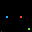 | • 1-4: Move • 5: Whistle |
| sy02 | Pattern Puzzles | 11×11 | 5 | **Staggered mirror**: mirror targets use half-row offset (`mirror_stagger` in data). | 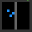 | • 6: Place/remove block |
| tb03 | Environmental Manipulation | 24×24 | 5 | **Reef growth**: like bridge decay, plus random **rock** spawns on water every **M** steps (`reef_every`). |  | • 1-4: Move • 6: Toggle bridge |
| tg01 | Survival | 12×12 | 5 | **Tag evasion**: chaser moves every other step; survive **T** steps or reach a safe zone. | 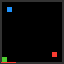 | • 1-4: Move |
| tt03 | Collection | 16-24 | 3 | **Collector spawns**: patrol collection plus new yellow targets every **K** steps until cap (`spawn_every`, `target_cap`). |  | • 1-4: Move |
| ul02 | Puzzle Mechanics | 8-12 | 5 | **Two-key unlock**: key A before door A and key B before door B; wrong door order loses. | 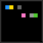 | • 1-4: Move |
| wm02 | Survival / Timing | 32×32 | 5 | **Lane moles**: moles spawn in rotating lane columns; wrong-lane click while a mole is up costs a life. |  | • 6: Click |
| zq02 | Puzzle Mechanics | 8-10 | 5 | **Dual-phase hazards**: two independent blinking hazard sets with different `period` / phase offset in data. |  | • 1-4: Move |
| ju01 | Movement / Planning | 10×10 | 5 | **Jump tile**: landing on a jump floor moves two cells in the same direction when the skip cell is clear. |  | • 1-4: Move |
| co01 | Puzzle Mechanics | 10×10 | 5 | **Color gate**: recolor pads set active hue; only matching doors open. |  | • 1-4: Move |
| em01 | Puzzle / Planning | 10×10 | 5 | **Echo move**: every second step repeats your previous cardinal delta. |  | • 1-4: Move |
| nu01 | Collection / Order | 10×10 | 5 | **Number fuse**: collect numbered tokens in descending order; wrong pickup loses. |  | • 1-4: Move |
| gl01 | Hazard / Path | 10×10 | 5 | **Glass floor**: third visit to the same glass cell loses. |  | • 1-4: Move |
| or01 | Puzzle / Timing | 10×10 | 5 | **Orbit keys**: keys rotate clockwise around a pillar each step; pick up when orth-adjacent, then reach the goal. |  | • 1-4: Move |
| ex03 | Puzzle Mechanics | 8×8 | 5 | **Moving exit hold**: like ex02, but the green pad slides on a timer (`pad_period`, `pad_delta`). |  | • 1-4: Move • 5: Hold |
| zq03 | Puzzle Mechanics | 8-10 | 5 | **Synced hazard masks**: one safe beat per cycle where both fields are off (`mask_a` / `mask_b`). |  | • 1-4: Move |
| nw03 | Puzzle Mechanics | 8-12 | 5 | **Sticky vector arrows**: pending impulse is only consumed after a successful move (blocked moves keep the queue). |  | • 1-4: Move |
| rs03 | Cognitive Flexibility | 8-16 | 5 | **Forbidden stripe**: HUD shows a color that is **never** collectible; clear all other targets. |  | • 1-4: Move |
| sv03 | Survival / Timing | 8-24 | 5 | **Dual shelters**: yellow pauses hunger decay, magenta pauses warmth; **alternate** shelter types on entry. |  | • 1-4: Move • 5: Idle |
| sq03 | Sequencing | 12×12 | 5 | **Dual queue**: two color queues; **ACTION6** on either head; wrong tap resets **both**. |  | • 6: Click block |
| dr01 | Puzzle / Rush | 10×10 | 5 | **Drill rush**: **ACTION5** breaks one adjacent wall; tight **step** budget. |  | • 1-4: Move • 5: Drill |
| vi01 | Survival / Hazard | 12×12 | 5 | **Infection**: plague spreads every **K** steps; cyan **vaccine** then green exit. |  | • 1-4: Move |
| wa01 | Movement | 12×12 | 5 | **Warp line**: crossing a warp band shifts **+2** on its axis when clear. |  | • 1-4: Move |
| fi01 | Simulation / Hazard | 14×14 | 5 | **Firebreak**: fire spreads each step; **ACTION5** places a blue **break** tile blocking spread. |  | • 1-4: Move • 5: Place break |
| ul03 | Puzzle Mechanics | 10×10 | 5 | **Master key**: both **silver** keys reveal **gold**; gold opens **both** doors. |  | • 1-4: Move |
| wm03 | Survival / Timing | 32×32 | 5 | **Decoy moles**: gray **decoys** in wrong lanes; whack decoy = lose life. |  | • 6: Click |
| ms03 | Memory / Hidden State | 8-12 | 5 | **Chord sapper**: clues count mines in **Chebyshev radius 2**; **ACTION6** flags (`display_to_grid`). |  | • 1-4: Move • 6: Flag |
| lo03 | Pattern Puzzles | 4×4–6×6 | 5 | **Diagonal torus Lights Out**: **ACTION6** toggles cell + **8** neighbors with wrap (`lo02` + diagonals). |  | • 1-4: No-op • 6: Click |
| pt03 | Pattern Puzzles | 64×64 | 5 | **Band lock**: odd levels rotate **rows** only, even levels **columns** only (`difficulty`). |  | • 6: Click band |
| sy03 | Pattern Puzzles | 11×11 | 5 | **Vertical mirror**: template above divider **y=5**, build mirrored copy below (`sy02` geometry rotated). |  | • 6: Place/remove |
| mm03 | Memory / Hidden State | 64×64 | 5 | **Memory quads** (mm02 variant): flip **four** tiles; clear when all four match. |  | • 6: Click |
| ff03 | Precision / Topology | 64×64 | 5 | **Limited erases** (ff02 variant): capped enclosure erasers per level in data. |  | • 1-4: No-op • 6: Click |
| lw03 | Path / Topology | 24–32 | 5 | **Shared edges OK** (lw02 variant): relaxed perpendicular corridor rule; segment edge ownership. |  | • 1–2 • 5 undo • 6: Extend |
| rp03 | Graph / Logic | 32×32 | 5 | **Splitter relay** (rp02 variant): T-relays fork pulses to both arms. |  | • 1–4: No-op • 5: Fire • 6: Toggle |
| ml03 | Geometry | 24×24 | 5 | **Fragile mirrors** (ml02 rules): same **move + adjacent mirror** play as **ml02**, but every mirror the beam **reflects from** is **removed** after that shot (failed shots eat optics). |  | • 1-4: Move • 5: Fire • 6: Mirror |
| ck03 | Graph / Logic | 24×24 | 5 | **Checkpoint wire** (ck02 variant): cyan checkpoint must lie on successful test path. |  | • 1-4: No-op • 5: Test • 6: Toggle |
| ph03 | Field / Math | 24×24 | 5 | **XOR neighbor step** (ph02 variant): **ACTION5** XORs cell with orth neighbors mod N. |  | • 1-4: No-op • 5: Step • 6: Inc |
| bn03 | Exploration | 64×64 | 5 | **Shrinking beacon** (bn02 variant): each **ACTION5** beacon reduces max light radius by 1. |  | • 1-4: Move • 5: Beacon • 6: Flag |
| bi01 | Movement / Chess | 10×10 | 5 | **Bishop courier**: ACTION1–4 slide diagonally (NW/NE/SW/SE) until a wall blocks. |  | • 1-4: Diagonal slide |
| rk01 | Movement / Chess | 10×10 | 5 | **Rook courier**: ACTION1–4 slide orthogonally until a wall blocks. |  | • 1-4: Rook slide |
| sn01 | Collection / Classic | 12×12 | 5 | **Snake collect**: eat all yellow food; grow; walls and self-collision lose. |  | • 1-4: Move |
| tr01 | Hazard / Path | 10×10 | 5 | **Toxic floor**: cells expire `ttl` world steps after first visit; standing on expired tile loses. |  | • 1-4: Move |
| vp01 | Hazard / Path | 10×10 | 5 | **Void path**: each cell allows only one visit; second visit loses. |  | • 1-4: Move |
| bt01 | Resource / Movement | 10×10 | 5 | **Battery steps**: charge drops each move; cyan pads refill; 0 charge loses. |  | • 1-4: Move |
| dg01 | Environmental | 10×10 | 5 | **Dig mud**: ACTION5 removes one orth-adjacent mud tile (per-level budget). |  | • 1-4: Move • 5: Dig |
| mb01 | Environmental | 10×10 | 5 | **Magnet crates**: after each move, metal crates slide one cell toward you when free. |  | • 1-4: Move |
| op01 | Environmental | 8-10 | 5 | **One-push crate**: each crate may be pushed at most once; second push loses. |  | • 1-4: Move |
| kb01 | Puzzle / Key | 10×10 | 5 | **Key leash**: yellow key must stay within Manhattan **R** of the player or lose. |  | • 1-4: Move |
| eb01 | Movement / Field | 10×10 | 5 | **Escalator row**: on the marked row, after each move you auto-slide east while free. |  | • 1-4: Move |
| fg01 | Memory / Exploration | 10×10 | 5 | **Fog of war**: Chebyshev radius **r** hides distant sprites (logic unchanged). |  | • 1-4: Move |
| jw01 | Pattern | 10×10 | 5 | **Jigsaw swap**: ACTION6 on magenta trigger swaps two authored rectangles; push boxes to the goal. |  | • 1-4: Move • 6: Click trigger |
| pd01 | Graph / Plumbing | 10×10 | 5 | **Pipe drop**: ACTION6 cycles empty → H → V pipe; connect cyan source to yellow sink. |  | • 1-4: No-op • 6: Cycle pipe |
| rh01 | Survival / Hazard | 10×10 | 5 | **Rotating hazard row**: lethal band advances one row every **N** moves. |  | • 1-4: Move |
| av01 | Simulation | 10×10 | 5 | **Avalanche**: rocks fall after each move; crushed loses. |  | • 1-4: Move |
| pw01 | Puzzle / Logic | 10×10 | 5 | **Dual plate crates**: both yellow plates must hold a crate; then reach the goal. |  | • 1-4: Move |
| es01 | Escort | 10×10 | 5 | **Escort**: NPC moves toward you each turn; both reach colored goals; collision loses. |  | • 1-4: Move |
| wg01 | Movement / Chaos | 10×10 | 5 | **Wind gust**: every **K** steps you are pushed one cell east when free. |  | • 1-4: Move |
| hs01 | Stealth / Chase | 10×10 | 5 | **Heatseeker**: hunter steps toward you every two player moves; reach goal safely. |  | • 1-4: Move |
| tm01 | Survival / Resource | 10×10 | 5 | **Twin meters**: oxygen + heat decay; pads refill; survive **T** steps. |  | • 1-4: Move |
| cy01 | Movement / Field | 10×10 | 5 | **Cyclic conveyor**: on conveyor row, after each step slide west while free. |  | • 1-4: Move |
| in01 | Path / Hazard | 10×10 | 5 | **Ink trail**: leaving a cell drops blocking ink. |  | • 1-4: Move |
| rc01 | Puzzle / Teleport | 10×10 | 5 | **Recall once**: ACTION5 teleports back to start (one use per level). |  | • 1-4: Move • 5: Recall |
| bl01 | Puzzle / Phase | 10×10 | 5 | **Phase wall**: ACTION5 arms the next move to pass through one wall cell. |  | • 1-4: Move • 5: Arm phase |
| sw01 | Manipulation | 10×10 | 5 | **Swap partner**: ACTION5 swaps with orth-adjacent magenta partner. |  | • 1-4: Move • 5: Swap |
| tw01 | Ordering | 10×10 | 5 | **Two-touch**: visit orange waypoint before green goal counts. |  | • 1-4: Move |
| pm01 | Movement / Meta | 10×10 | 5 | **Prime steps**: cardinal moves only apply on prime step indices; composites no-op. |  | • 1-4: Move |
| hz01 | Hazard / Growth | 10×10 | 5 | **Hazard growth**: red hazards spread orthogonally every **M** steps. |  | • 1-4: Move |
| cq01 | Territory / Coverage | 10×10 | 5 | **Ring tour**: visit every orange ring marker, then the goal. |  | • 1-4: Move |
| lf01 | Timing | 10×10 | 5 | **Laser fence row**: fixed row lethal on alternating periods of **P** steps. |  | • 1-4: Move |
| sb01 | Simulation | 10×10 | 5 | **Sand fall**: sand piles fall like rocks; crushed loses. |  | • 1-4: Move |
| wp01 | Logistics | 10×10 | 5 | **Weight plate**: orth-adjacent weight (you=1, crate=2) must reach **W** to unlock goal tile. |  | • 1-4: Move |
| dv01 | Puzzle / Timeline | 10×10 | 5 | **Divergent walls**: ACTION5 toggles timeline; only active timeline’s walls collide. |  | • 1-4: Move • 5: Toggle |
| ox01 | Field / XOR | 10×10 | 5 | **XOR hazards**: red vs magenta hazard layers alternate collidable each step. |  | • 1-4: Move |
| sl01 | Permutation / Puzzle | 3×3 | 5 | **Slide puzzle**: swap the hole with adjacent tiles until the board matches the goal; step limit. |  | • 1-4: Swap with up/down/left/right neighbor |
| ci01 | Environmental Manipulation | 8–12 | 5 | **Crate ice**: player moves normally; pushed crates slide until wall, crate, or mud. |  | • 1-4: Move |
| rv01 | Collection / Hazard | 8–16 | 5 | **Rotating sparks**: collect targets while red hazards step together in a wind direction that cycles N→E→S→W. |  | • 1-4: Move |
| pk01 | Topology / Packing | 8–12 | 5 | **Polyomino pack**: ACTION5 toggles domino vs straight-tromino mode; ACTION6 clicks place pieces on marked cells. |  | • 5: Mode • 6: Click |
| kv01 | Circuit / Logic | 8×8 | 5 | **Voltage ladder**: cycle three series resistors (1/2/4 Ω); ACTION5 checks probe voltages vs targets. |  | • 1-3: Cycle R • 5: Check |
| wr01 | Spatial / Rotation | 12×12 | 5 | **World rotation**: entire level rotates 90° CW every N steps; ACTION5 braces to skip the next rotation (budget). |  | • 1-4: Move • 5: Brace |
| dp01 | Puzzle / Planes | 10×14 | 5 | **Dual plane**: ACTION5 toggles A/B; `plane_a` / `plane_b` walls only collide on their plane. |  | • 1-4: Move • 5: Toggle plane |
| df01 | Field / Simulation | 16×16 | 5 | **Heat diffusion**: hot/cold sources; temperature diffuses each step; goal needs band hit; ACTION6 vents 3×3. |  | • 1-4: Move • 6: Vent |
| rn01 | Environmental / Graph | 12×12 | 5 | **Rope anchors**: ACTION6 two orth-adjacent anchors over water places a walkable rope on the middle cell. |  | • 1-4: Move • 6: Click anchors |
| sc01 | Stealth / Trail | 14×14 | 5 | **Scent + cone**: guard sees eastward; high scent under LOS loses; ACTION5 masks scent briefly. |  | • 1-4: Move • 5: Mask |
| au01 | Resource / Path | 10×10 | 5 | **Bonus steps**: tight move budget; cyan bonus pads add steps when entered. |  | • 1-4: Move |
| cf01 | Hazard / Time | 10×10 | 5 | **Fallow**: re-entering a cell before F world steps pass loses. |  | • 1-4: Move |
| ep01 | Path / Budget | 12×12 | 5 | **Pain budget**: entering a cell costs its visit count; exceed the global budget to lose. |  | • 1-4: Move |
| tf01 | Timing / Traffic | 14×14 | 5 | **Crossing light**: orange crossing tiles may be entered only on green phase (4-step cycle). |  | • 1-4: Move |
| ec01 | Coordination / Mirror | 12×12 | 5 | **Echo ghost**: a mirror copy moves with reflected horizontal delta; wall collision for the echo blocks the whole move. |  | • 1-4: Move |
| tk01 | Manipulation | 10×10 | 5 | **Telekinetic tug**: ACTION5 pulls the nearest crate one greedy Manhattan hop toward you; else push sokoban-style. |  | • 1-4: Move • 5: Tug |
| hn01 | Logic / Classic | 10×12 | 5 | **Tower of Hanoi**: ACTION1–3 pick peg; ACTION5 pick/drop top disk; stack all on the right peg. |  | • 1-3: Peg • 5: Pick/drop |
| fb01 | Hazard / Push | 12×12 | 5 | **Fuse bombs**: push bombs with countdown; blast removes adjacent weak walls and loses if you are adjacent. |  | • 1-4: Move |
| lp01 | Ordering / Lexical | 9×11 | 5 | **Letter path**: visit letter pads in the authored word order; wrong letter loses. |  | • 1-4: Move |
| rb01 | Timing / Rhythm | 11×11 | 5 | **Rhythm gate**: movement only applies every B world steps (beat). |  | • 1-4: Move |
| at01 | Simulation / Steering | 16×16 | 5 | **Ant trail**: ACTION5 drops pheromone; ant follows strongest adjacent scent toward the exit hole. |  | • 1-4: Move • 5: Scent |
| wb01 | Dynamic / Walls | 16×16 | 5 | **Wall belt**: marked wall segments on a row shift east each step (wrap); crushed if a wall lands on you. |  | • 1-4: Move |
| lk01 | Logic / Lock | 10×10 | 5 | **Lock tumblers**: while the door exists ACTION1–3 cycle digits; when matched the door vanishes; then 1-4 move to goal. |  | • 1-4: Tumble / move |
| dn01 | Topology / Torus | 16×16 | 5 | **Donut wind**: torus wrap east increments winding; need winding ≥ 2 on the goal to clear. |  | • 1-4: Move |
| qt01 | Logic / Split | 10×10 | 5 | **Quantum split**: magenta splitter duplicates offset; cyan observer collapses; both ghosts cannot hit walls. |  | • 1-4: Move |
| vt01 | Logic / Weights | 12×12 | 5 | **Vote plates**: sum of crate weights **on** the plate mod M opens the door; reach the goal. |  | • 1-4: Move |
| fc01 | Coordination / Chain | 14×10 | 5 | **Follow chain**: three tails copy prior segment positions; you and tails must reach the exit neighborhood together. |  | • 1-4: Move |
| pj01 | Timing / Deflect | 14×14 | 5 | **Bolt bounce**: bolt steps each frame; ACTION6 toggles / vs \\ mirrors; sink the bolt without getting hit. |  | • 1-4: Move • 6: Mirror |
| gc01 | Growth / Routing | 14×14 | 5 | **Coral creep**: coral spreads to empty neighbors every M steps (blocking, non-lethal); reach the goal. |  | • 1-4: Move |
| sr01 | Logic / Algebra | 12×12 | 5 | **Aura XOR**: RGB zones toggle aura bits; wash clears; door opens when aura matches the target triple. |  | • 1-4: Move |
| cs01 | Graph / Click | 8×8 | 7 | **Vertex cover**: toggle cyan vertices so every edge touches a selected vertex within budget. |  | • 1-4: No-op • 6: Toggle vertex |
| ct01 | Graph / Click | 8×8 | 7 | **Independent cover**: no adjacent selections; every gray mark must be selected or orth-adjacent to one. |  | • 1-4: No-op • 6: Toggle |
| cz01 | Logic / Click | 8×8 | 7 | **Row XOR pick**: **ACTION1–4** select row 0–3; **ACTION6** flips all bits in that row; match target. |  | • 1–4: Pick row • 6: Flip row |
| eg01 | Pattern / Click | 6×6 | 7 | **Hamming target**: **ACTION6** cycles cell color; win when distance to target ≤ **D**. |  | • 1-4: No-op • 6: Cycle cell |
| ff04 | Precision / Topology | 8×8 | 7 | **Gradient budget flood**: grow paint from seed; total Manhattan cost to seed ≤ budget; match gray hints. |  | • 1-4: No-op • 6: Add cell |
| gp04 | Pattern Puzzles | 8×8 | 7 | **Blob cap**: paint like **gp01** but also keep ≤ **K** orthogonal yellow components. |  | • 1-4: No-op • 6: Toggle paint |
| lo04 | Pattern Puzzles | 5–6 | 7 | **Diagonal Lights Out**: **ACTION6** toggles cell + four diagonals only. |  | • 1-4: No-op • 6: Click |
| lo05 | Pattern Puzzles | 8×8 | 7 | **Knight Lights Out**: **ACTION6** toggles cell + all knight-move neighbors. |  | • 1-4: No-op • 6: Click |
| qr04 | Pattern Puzzles | 8×8 | 7 | **3×3 twist**: **ACTION6** rotates a **3×3** color block clockwise (**qr01** kernel). |  | • 1-4: No-op • 6: Click |
| sq04 | Sequencing / Ordering | 12×12 | 7 | **LIFO sequencing**: clear blocks in **stack** order (last in HUD first), **sq01**-style clicks. |  | • 6: Click block |
| sq05 | Sequencing / Ordering | 12×12 | 7 | **Double-tap lock**: FIFO order; each block needs **two** consecutive correct taps to clear. |  | • 6: Click block |
| pt04 | Pattern Puzzles | 8×8 | 7 | **Tile swap**: two **ACTION6** picks swap **1×1** colors; match the target grid. |  | • 1–4: No-op • 6: Select / swap |
| pt05 | Pattern Puzzles | 8×8 | 7 | **Slide row**: click yellow **header** (x=0) to cycle that row’s colors left; match key. |  | • 1–4: No-op • 6: Header |
| sy04 | Pattern Puzzles | 11×11 | 7 | **Diagonal mirror**: template on **i<j**; build matching dots on **x>y** across **y=x**. |  | • 6: Toggle mirror |
| dm04 | Tiling | 8×8 | 7 | **L-tromino cover**: three **ACTION6** picks forming an **L** in a 2×2 cover marked cells. |  | • 6: Pick 3 cells |
| pk02 | Topology / Packing | 10×10 | 7 | **Ribbon edges**: two-click adjacent vertices to claim a marked unit edge; cover all. |  | • 5: No-op • 6: Edge |
| fl04 | Path / Click | 12×12 | 7 | **Capped path**: connect **A→B** with click path length ≤ **max_len**. |  | • 1–4: Move • 6: Path |
| lw04 | Path / Click | 12×12 | 7 | **Corner budget**: connect **A→B** with length and **turn** caps. |  | • 1–4: Move • 6: Path |
| sf04 | Pattern / Stencil | 16×16 | 7 | **Rotate stencil**: **ACTION5** spins L-tromino mask; **ACTION6** paints. |  | • 5: Rotate • 6: Paint |
| sp04 | Simulation | 12×12 | 7 | **Sandpile sinks**: like **sp01** but grains falling into cyan sinks disappear. |  | • 1–4: No-op • 6: Add grain |
| ll04 | Simulation | 12×12 | 7 | **Torus Life**: Conway on a torus; **ACTION6** toggles; **ACTION5** steps. |  | • 5: Gen • 6: Toggle |
| ab01 | Simulation | 10×10 | 7 | **Mod sandpile**: stabilize with total grain count **mod P == R**. |  | • 1–4: No-op • 6: Add grain |
| df04 | Field / Simulation | 10×10 | 7 | **Diffuse only**: **ACTION5** heat step; **ACTION6** 3×3 vent; probe in band. |  | • 5: Tick • 6: Vent |
| ih01 | Field / Simulation | 10×10 | 7 | **Heaters**: **ACTION5** global chill; **ACTION6** toggles heater pads. |  | • 5: Tick • 6: Toggle heater |
| tc04 | Simulation / Routing | 10×10 | 7 | **Conveyor**: **ACTION5** moves packages on arrows; **ACTION6** rotates arrow. |  | • 5: Step • 6: Rotate |
| zm04 | Simulation / Spread | 12×12 | 7 | **Strains**: **ACTION5** switch+spread; **ACTION6** blocks a cell. |  | • 5: Strain • 6: Block |
| pu04 | Graph / Plumbing | 16×16 | 7 | **Tee pipes**: **ACTION6** cycles **H / V / T**; connect source→sink. |  | • 1–4: No-op • 6: Cycle |
| pd04 | Graph / Plumbing | 12×12 | 7 | **Plus junction**: toggle full **+** open/closed; connect flow. |  | • 6: Toggle |
| ck04 | Circuit / Logic | 14×14 | 7 | **Directed wire**: each tile’s arrow rotates with **ACTION6**; reach **out**. |  | • 6: Rotate |
| rp04 | Graph / Relay | 12×12 | 7 | **Relay pulse**: **ACTION6** toggles relays; **ACTION5** floods from source. |  | • 5: Pulse • 6: Toggle |
| ph04 | Logic / Algebra | 8×1 row | 7 | **Mod row step**: **ACTION5** applies neighbor-sum **mod R** on a cyclic row. |  | • 5: Step |
| ml04 | Timing / Laser | 16×16 | 7 | **Stepped bolt** on **10×10**: **ACTION5** advances laser **one cell** per press; **ACTION6** cycles fixed mirror tiles **/ → \\ → empty** (no placement inventory). Distinct from **ml01–ml03** continuous-ray + place/cycle model. |  | • 5: Fire • 6: Mirror |
| pj04 | Timing / Deflect | 14×14 | 7 | **Fixed shooter**: **ACTION5** bolt; **ACTION6** places mirrors (minimal avatar). |  | • 5: Bolt • 6: Mirror |
| wm04 | Timing / Reflex | 32×32 | 7 | **Whack**: wrong click shortens the timer. |  | • 6: Click |
| sg04 | Timing / Rhythm | 12×12 | 7 | **Dual commit**: two-arm timing like **sg01**. |  | • 5–6: Timing |
| ng04 | Pattern / Layer | 12×12 | 7 | **Multi-layer** cycle path edit (**ng01** family). |  | • 6: Edit |
| bn04 | Stealth / Reveal | 16×16 | 7 | **Line/column flash**: **ACTION5** axis reveal (**bn01** family). |  | • 5: Axis • 6: Flag |
| sk04 | Manipulation | 8×8 | 7 | **Fixed / winch sokoban**: minimal walking. |  | • 1–4 / 6: Per level |
| pb04 | Push / Minimal | 8×8 | 7 | **One crate** with constrained interaction. |  | • 1–4 / 6: Per level |
| wl05 | Dynamic / Physics | 12×12 | 7 | **Ball + ramps**: **ACTION5** tick; **ACTION6** toggles ramps. |  | • 5: Tick • 6: Ramp |
| hn04 | Logic / Classic | 10×12 | 7 | **4 peg Hanoi**: **ACTION1–4** select peg; **ACTION5** pick/drop. |  | • 1–4: Peg • 5: Pick/drop |
| kv04 | Circuit / Logic | 8×8 | 7 | **Two ladders**: **ACTION1–3** / **ACTION4** cycle branches; **ACTION5** verify. |  | • 1–4: Cycle • 5: Check |
| rs04 | Logic / Phase | 10×10 | 7 | **XOR-safe collect**: phase bits pick which target color may clear. |  | • 5: Phase • 6: Clear |
| ms04 | Logic / Deduction | 8×8 | 7 | **Edge-adjacent clues**: **ACTION6** flags mines. |  | • 6: Flag |
| cw01 | Logic / Click | 12×12 | 7 | **2-SAT literals**: **ACTION6** toggles a variable; satisfy all clauses. |  | • 6: Toggle literal |
| cx01 | Graph / Click | 10×10 | 7 | **Disconnect cut**: toggle **gates** until **S** and **T** split. |  | • 6: Toggle gate |
| cu01 | Tiling / Click | 10×10 | 7 | **Cover yellow**: **ACTION5** domino vs L-tool; **ACTION6** places. |  | • 5: Tool • 6: Place |
| cv01 | Graph / Click | 8×8 | 7 | **List coloring**: **ACTION6** cycles allowed colors; neighbors differ. |  | • 6: Cycle |
| mm04 | Memory | 64×64 | 7 | **One peek / level**: **ACTION5** briefly reveals unmatched tiles. |  | • 5: Peek • 6: Flip |
| mm05 | Memory | 64×64 | 7 | **Sticky matches**: an **edge-aligned** matched pair blocks flips on cells that sit orthogonally next to **both** tiles (diagonal pairs do not). |  | • 6: Flip |
| fe02 | Simulation / Abstract | 8×8 | 7 | **Vote + ratify**: **ACTION1–4** tally; **ACTION5** picks the leading rule (tie → higher index) and applies **one** `(a,b,c)` tick; **`need`** ratifications / level; keep **a,b,c** in **1..9**. |  | • 1–4: Vote • 5: Ratify |

Implementation for each row lives under `environment_files/<Game>/<version>/` (one package dir per stem; `run_game.py --game <Game> --version auto` picks it). Registry column **Game** is the stem, not the full `game_id` in `metadata.json`.
