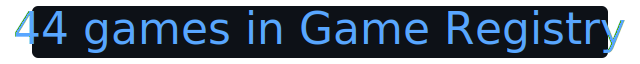

# ARC-Interactive (Community)

A collection of games for the ARC-AGI-3 benchmark.

<!-- Auto-updated on push to `main` when `GAMES.md` changes (see `.github/workflows/readme-stats.yml`). -->
<!-- readme-stats:begin -->

<!-- Static SVG: VT323 + terminal blue (assets/fonts/VT323-Regular.ttf, OFL). -->
<p align="center">
  
</p>

<!-- readme-stats:end -->

See [GAMES.md](GAMES.md) for the complete game registry with previews.

See [CONTRIBUTING.md](CONTRIBUTING.md) for how to run games locally and create new ones.

**Add your game:** implement it under `environment_files/{game_id}/v1/`, add a row to the [GAMES.md](GAMES.md) registry (title, grid, levels, preview, actions), then open a pull request. The [create-arc-game skill](skills/create-arc-game/SKILL.md) and [AGENTS.md](AGENTS.md) describe the patterns reviewers expect—whether you code by hand or with an AI agent.

<p align="center">
  <a href="CONTRIBUTING.md#creating-a-new-game"></a>
  &nbsp;
  <a href="GAMES.md"></a>
</p>

## Quickstart

Requires [Python 3.12+](https://www.python.org/) and [uv](https://github.com/astral-sh/uv). From the repo root, install dependencies once:

```bash
uv sync
```

Then run a game (example: tutorial **ez01**):

```bash
uv run python run_game.py --game ez01 --version v1
```

Use any `game_id` / `version` pair that appears in `uv run python run_game.py --list`.

## Kaggle Benchmarks

If you’ve finished Kaggle-side setup—a **dataset** whose root contains **`environment_files/`**, one or more **published benchmark tasks** built from [`benchmarks/kaggle/arc_kaggle_notebook_template.py`](benchmarks/kaggle/arc_kaggle_notebook_template.py), and those tasks **added to a benchmark**—you’re aligned with this repo’s layout. Operational details (bootstrap deps for papermill vs Python 3.12, optional notebook regeneration, model proxy / region notes) live in **[`benchmarks/README.md`](benchmarks/README.md)** and **[`benchmarks/kaggle/notebooks/README.md`](benchmarks/kaggle/notebooks/README.md)**.

Local checks without calling the hosted model:

```bash
uv run python -m benchmarks.kaggle.run_task_kbench_mock
```
